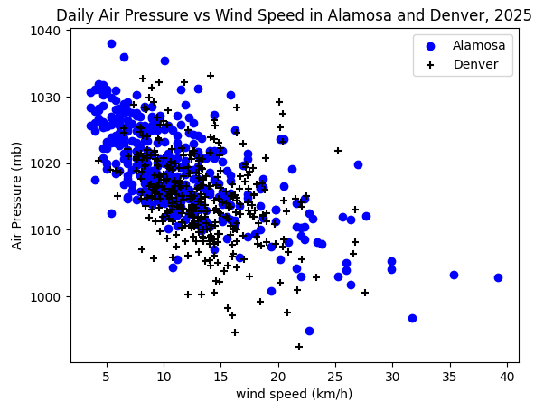

# DAT 2002 Portfolio Page
## Guy Francis

### Visualization 1

This visualization shows the relationship betweeen wind speed and air pressure at two Colorado locations. At both locations, there appears to be a negative correlation: as one of these variables increases the other decreases. The relationship appears slightly stronger for Alamosa compared to Denver.

